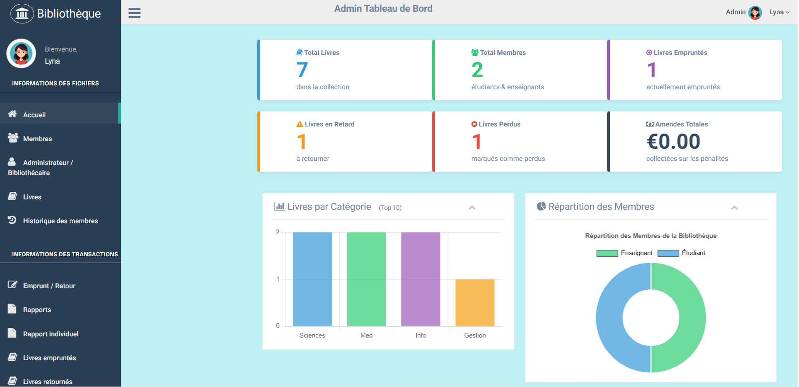

<h1 align="center">📚 Système de Gestion de Bibliothèque avec Code-Barres</h1>
<p align="center">
<em>Application web complète en PHP & MySQL pour automatiser la gestion d’une bibliothèque avec génération intelligente de codes-barres.</em>
</p>

<div align="center">





</div>

---

## 📖 Présentation

La gestion manuelle d’une bibliothèque — suivi des livres, gestion des membres, enregistrement des emprunts et retours — est lente, sujette aux erreurs et difficile à maintenir.

Ce projet propose un **Système de Gestion de Bibliothèque (LMS)** développé en **PHP 8.2 et MySQL**, intégrant un système moderne de **génération et lecture de codes-barres** pour automatiser et sécuriser toutes les opérations.

Il constitue :

- Un excellent projet académique (Licence / Master en Informatique)
- Un exemple concret d’architecture web complète
- Une démonstration de gestion de base de données relationnelle
- Une application fonctionnelle prête à être déployée en local

---

# 🚀 Fonctionnalités principales

Le système est organisé autour d’un **panneau Administrateur/Bibliothécaire complet**.

---

## 🖥 1. Tableau de bord Administrateur

Après connexion, l’administrateur accède à un tableau de bord professionnel affichant :

- 📊 Cartes statistiques :
  - Total des livres
  - Total des membres
  - Livres empruntés
  - Livres en retard
- 📈 Graphiques interactifs :
  - Répartition des livres par catégorie
  - Répartition des membres (Étudiants / Enseignants)

---

## 📚 2. Gestion complète des livres

- ➕ Ajout de nouveaux livres (Titre, ISBN, Éditeur, Année, Auteurs…)
- 🏷 Génération automatique d’un code-barres unique pour chaque exemplaire
- 🖨 Impression individuelle ou en masse des étiquettes code-barres
- ✏ Modification et suppression des livres
- 🔎 Recherche dynamique avec pagination et tri
- 📌 Gestion du statut :
  - Nouveau
  - Perdu
  - Endommagé

---

## 👥 3. Gestion des membres

- ➕ Ajout de membres (Étudiants ou Enseignants)
- 📝 Informations enregistrées :
  - Matricule
  - Nom
  - Filière
  - Contact
- 📂 Consultation et modification des profils
- 📜 Historique complet des emprunts et retours par membre

---

## 🔄 4. Module Transactions (Emprunt & Retour)

- 📷 Transactions via scan du code-barres
- 📅 Calcul automatique des dates de retour
- 💰 Calcul automatique des pénalités de retard
- ⚡ Traitement rapide et réduction des erreurs humaines

---

## 📊 5. Système de rapports

- 📄 Génération de rapports :
  - Livres empruntés
  - Livres retournés
  - Livres en retard
- 📆 Filtrage par intervalle de dates
- 👤 Rapport individuel par membre
- 🖨 Rapports optimisés pour impression

---

# 🛠 Technologies utilisées

- **Front-End** : HTML, CSS, JavaScript, Bootstrap
- **Back-End** : PHP 8.2
- **Base de données** : MySQL
- **Génération de codes-barres** : picqer/php-barcode-generator
- **Graphiques** : Chart.js
- **Gestion des dépendances** : Composer

---

# ⚙️ Prérequis

Avant l’installation, assurez-vous d’avoir :

- XAMPP ou WAMP
- PHP 8.2 ou supérieur
- MySQL
- Composer

---

# 🧩 Guide d’installation

---

## 1️⃣ Télécharger et placer le projet

1. Télécharger le fichier `.zip`
2. Extraire le contenu
3. Copier le dossier dans :

**XAMPP**

C:\xampp\htdocs\

**WAMP**

C:\wamp64\www\

**Exemple :**

C:\xampp\htdocs\Systeme-Gestion-Bibliotheque


---

## 2️⃣ Installer les dépendances (obligatoire)

Ouvrir un terminal dans le dossier du projet :

```
composer install
```

Cette commande :

Crée le dossier vendor

Installe la bibliothèque de génération de codes-barres

Configure l’autoload automatique

⚠ Si erreur : vérifier que Composer est installé et ajouté au PATH.

---

## 3️⃣ Configuration de la base de données

Lancer Apache et MySQL

Ouvrir : http://localhost/phpmyadmin/

Créer une base de données : projet_bibli

Importer le fichier .sql situé dans database-sql-file/

---

## 4️⃣ Configuration de la connexion

Ouvrir le fichier :

include/dbcon.php

Modifier la connexion :

```

$con = mysqli_connect('localhost', 'root', '', 'projet_bibli');

```

Si MySQL utilise un mot de passe :

```

$con = mysqli_connect('localhost', 'root', 'votre_mot_de_passe', 'projet_bibli');

```

---

## 5️⃣ Lancer le projet

Accéder à : http://localhost/Systeme-Gestion-Bibliotheque/

🔐 Identifiants Administrateur

Nom d’utilisateur : admin

Mot de passe : admin123

---

## ⚠ Remarques importantes

Vérifier que Apache et MySQL sont actifs

Ne pas supprimer le dossier vendor

En cas d’erreur : relancer composer install

Vérifier que la base de données est correctement importée
